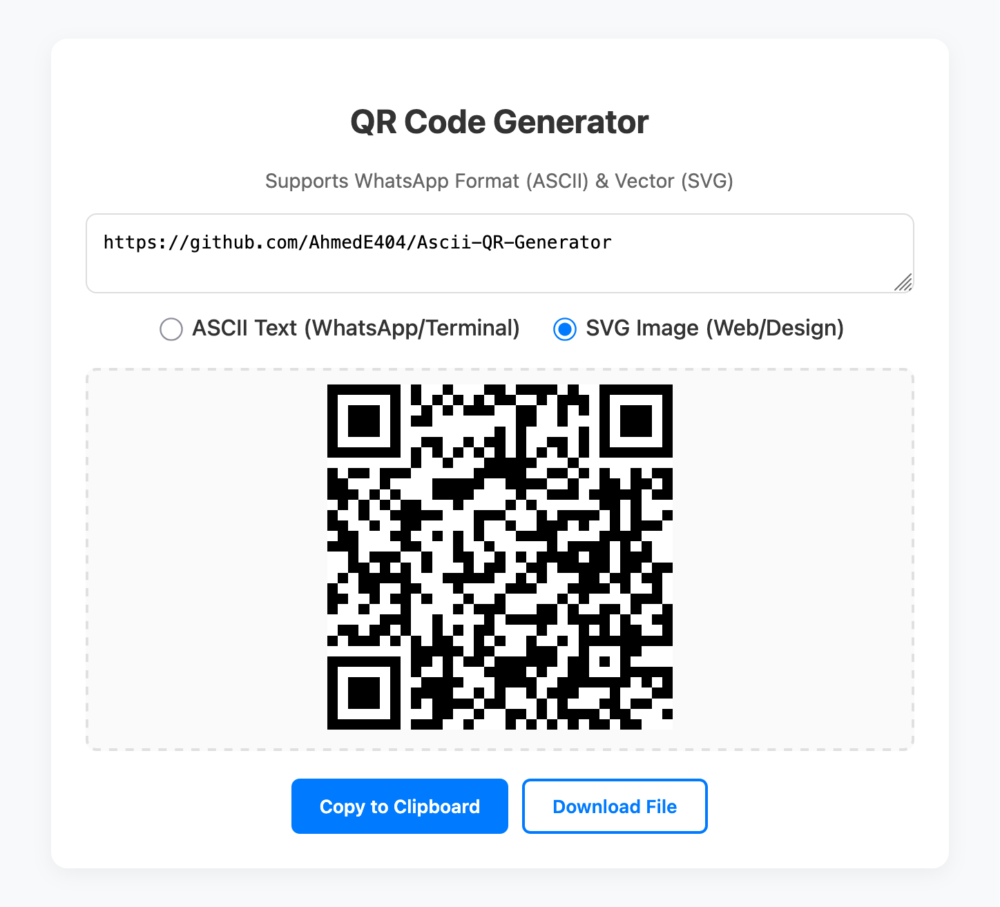

# 📱 ASCII & SVG QR Code Generator

[](README.md)

A lightweight, offline-first web tool that generates QR codes in **ASCII Text** (optimized for WhatsApp/Terminal) and **SVG Vector** formats.

> **Live Demo:** [Click here to try it live](https://AhmedE404.github.io/ascii-qr-generator/)



## ✨ Features

- **Double Mode:**
  - **ASCII Mode:** Generates QR codes using Unicode Half-Blocks (`▀`, `▄`, `█`).
  - **SVG Mode:** Generates crisp, scalable vector QR codes for design use.
- **WhatsApp Friendly:** The "Copy" button automatically wraps ASCII codes in triple backticks (` ``` `) to ensure monospace formatting on WhatsApp and Discord.
- **Offline First:** Tries to load the local `qrcode.min.js` library first. If missing, it automatically falls back to a CDN.
- **Smart Download:** - Downloads SVG as `.svg` file.
  - Downloads ASCII as an `.html` file with pre-styled `<pre>` tags for perfect viewing.
- **Privacy:** All generation happens client-side. No data is sent to any server.

## 🚀 How to Use

1. **Clone the repository:**
```bash
   git clone https://github.com/AhmedE404/ascii-qr-generator.git

```

2. **Open the project:**
Simply open `index.html` in your browser. No server or installation required!

## 📄 License

This project is licensed under the MIT License - see the [LICENSE](LICENSE) file for details.